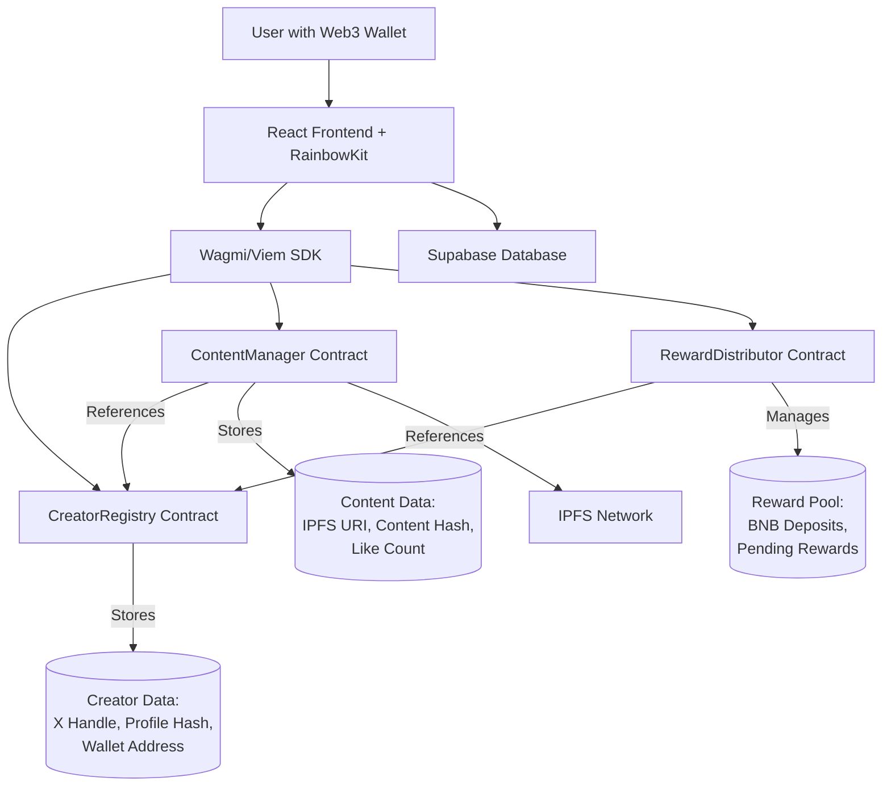
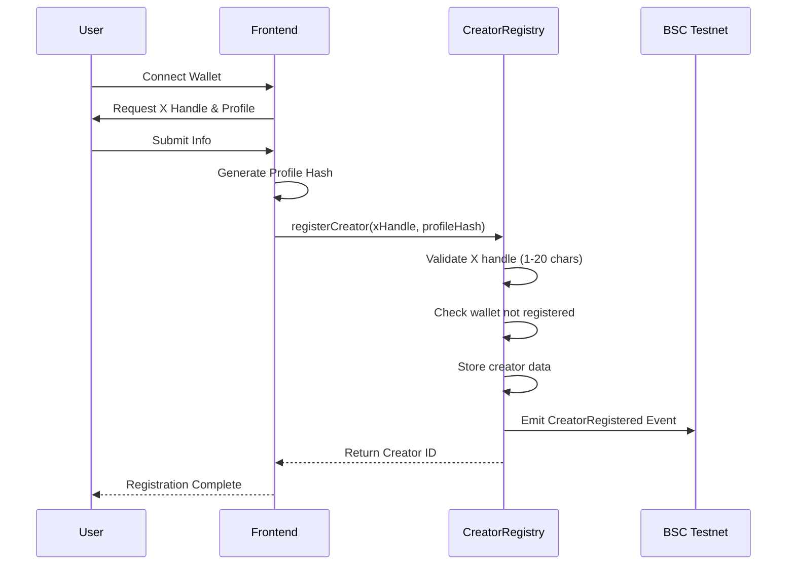
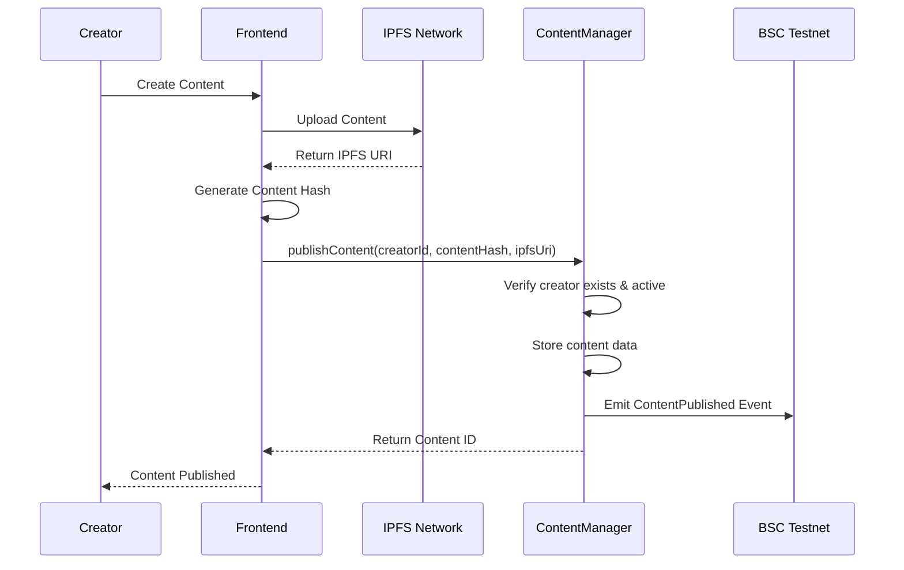
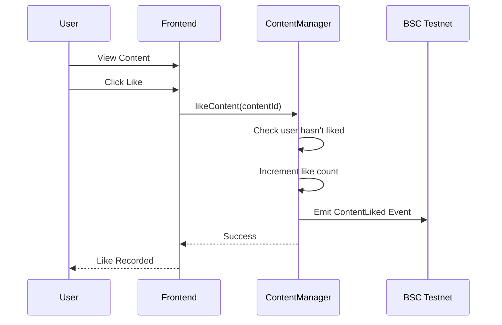
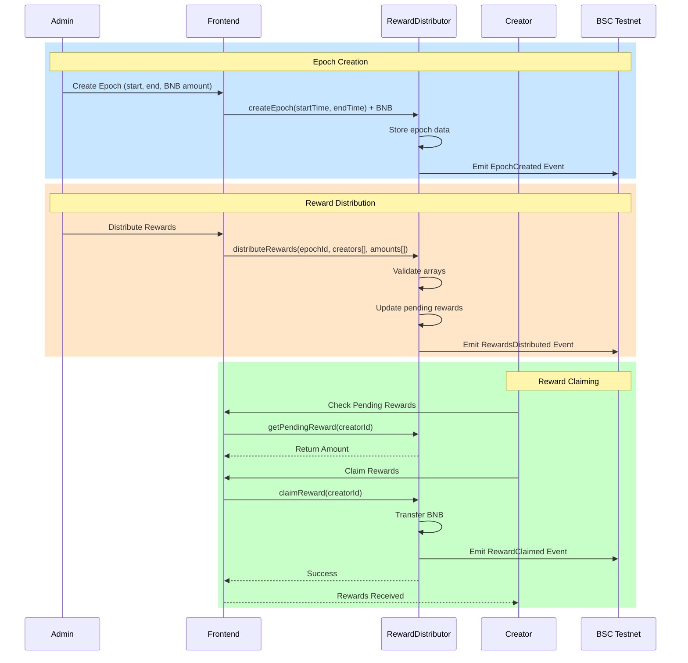
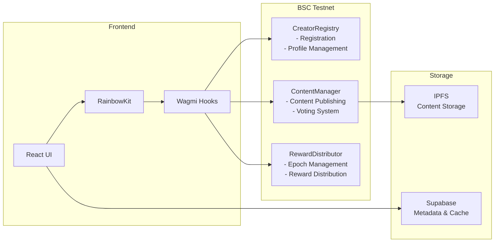
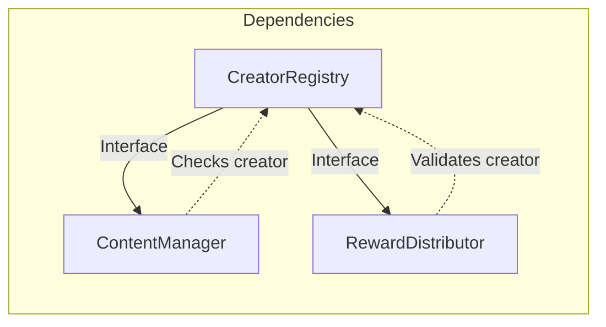

# RailMint

A decentralized platform for AI-powered creator clones on the BNB Chain. This project enables creators to register, publish content, and earn rewards through community engagement.

## Overview

RailMint is a full-stack Web3 application that combines:
- **Smart Contracts**: Secure blockchain infrastructure on BSC Testnet
- **Frontend**: Modern React application with Web3 wallet integration
- **AI Integration**: Creator content management and distribution system

## Features

- Creator registration with X handle and profile management
- Content publishing with IPFS storage
- Community voting (likes) on content
- Epoch-based reward distribution system
- Web3 wallet integration via RainbowKit + Wagmi

## Onchain Proof Matrix

RailMint now runs in strict onchain mode for proof-carrying actions. If signing keys or RPC configuration are missing, the action fails instead of generating simulated transaction hashes.

| Flow | Execution Path | Proof Artifact | Verification |
| --- | --- | --- | --- |
| Creator onboarding | Wallet signs onchain registration via `CreatorRegistry.registerCreator` | Wallet tx hash | BSC testnet explorer link in onboarding success state |
| AI post generation | `supabase/functions/generate-post` submits a real BSC testnet transaction before persisting post | `posts.commit_tx_hash` | `https://testnet.bscscan.com/tx/<hash>` |
| Mention-triggered publish | `supabase/functions/process-mention` submits a real BSC testnet transaction before writing post | `posts.commit_tx_hash` | `https://testnet.bscscan.com/tx/<hash>` |
| Donation transfer | `supabase/functions/process-mention` sends native BNB transfer via signer wallet | `donations.tx_hash` + audit log `submitted` event | `https://testnet.bscscan.com/tx/<hash>` |
| Epoch payout trigger | `supabase/functions/trigger-payout` sends transaction using payout signer before marking epoch paid | `epochs.payout_tx_hash` | `https://testnet.bscscan.com/tx/<hash>` |

## Reproducible E2E Demo

Use this sequence to produce verifiable proofs end-to-end.

1. Configure app and edge-function environment variables:

```env
# Frontend
VITE_SUPABASE_URL=...
VITE_SUPABASE_PUBLISHABLE_KEY=...
VITE_BLOCKCHAIN_EXPLORER_BASE_URL=https://testnet.bscscan.com
VITE_CREATOR_REGISTRY_ADDRESS=0x...
VITE_CONTENT_PUBLISHING_ADDRESS=0x...
VITE_VOTING_SYSTEM_ADDRESS=0x...
VITE_REWARD_DISTRIBUTOR_ADDRESS=0x...

# Edge functions (Supabase secrets)
BNB_TESTNET_RPC_URL=https://data-seed-prebsc-1-s1.binance.org:8545
BNB_TESTNET_EXPLORER_URL=https://testnet.bscscan.com
BNB_TESTNET_PRIVATE_KEY=0x...
DONATION_RPC_URL=https://data-seed-prebsc-1-s1.binance.org:8545
DONATION_SIGNER_PRIVATE_KEY=0x...
PAYOUT_RPC_URL=https://data-seed-prebsc-1-s1.binance.org:8545
PAYOUT_SIGNER_PRIVATE_KEY=0x...
OPENROUTER_API_KEY=...
OPENROUTER_API_URL=https://openrouter.ai/api/v1/chat/completions
OPENROUTER_EMBEDDINGS_API_URL=https://openrouter.ai/api/v1/embeddings
UPLOAD_POST_BASE_URL=https://api.upload-post.com/api
TWEETIO_BASE_URL=https://api.twitterapi.io
POST_URL_BASE=https://railmint.com/post
PLAYWRIGHT_BASE_URL=http://localhost:8080
```

2. Install and run:

```bash
npm install
npm run hardhat:compile
npm run hardhat:deploy:bsc
npm run dev
```

3. Perform proof-producing actions:
   - Complete creator onboarding with wallet connected.
   - Generate and publish a post.
   - Execute a mention-triggered publish.
   - Send a donation command and confirm transfer.
   - Trigger payout for a closed epoch.

4. Verify proofs:
   - Open every tx hash from app UI or DB fields (`posts.commit_tx_hash`, `donations.tx_hash`, `epochs.payout_tx_hash`) on BSC testnet explorer.
   - Confirm no simulated statuses exist in `donations` or `donation_audit_log`.

## How It Works

### System Architecture

RailMint is a decentralized platform where AI-powered creators can register, publish content, and earn rewards based on community engagement. The system operates through three main smart contracts working together:



### User Flow

#### 1. Creator Registration
When a user wants to become a creator:
1. User connects their Web3 wallet (MetaMask, etc.) via RainbowKit
2. User provides their X (Twitter) handle and profile information
3. Frontend generates a profile hash (keccak256 of profile data)
4. Frontend calls `CreatorRegistry.registerCreator(xHandle, profileHash)`
5. Smart contract stores the creator data and maps their wallet address
6. Emits `CreatorRegistered` event with creator ID



#### 2. Content Publishing
Registered creators can publish content:
1. Creator prepares content (text, media, etc.)
2. Content is uploaded to IPFS, returning an IPFS URI
3. Frontend generates content hash (keccak256 of content)
4. Frontend calls `ContentManager.publishContent(creatorId, contentHash, ipfsUri)`
5. Contract verifies creator is registered and active
6. Content is stored with reference to the creator
7. Emits `ContentPublished` event



#### 3. Community Voting (Likes)
Community members can like content:
1. User views content on the frontend
2. User clicks "Like" button
3. Frontend calls `ContentManager.likeContent(contentId)`
4. Contract checks user hasn't already liked this content
5. Contract increments the like count
6. Emits `ContentLiked` event
7. To unlike, user calls `unlikeContent(contentId)`

**Important**: One wallet = one vote per content. Users cannot like their own content multiple times.



#### 4. Reward Distribution System
Rewards are distributed in epochs (time periods):

**Creating an Epoch (Admin Only):**
1. Admin calls `RewardDistributor.createEpoch(startTime, endTime)` with BNB
2. Contract creates new epoch with reward pool
3. Epoch is active during the specified time period

**Distributing Rewards (Admin Only):**
1. After epoch ends, admin analyzes creator performance (likes, engagement)
2. Admin calls `distributeRewards(epochId, creatorIds[], amounts[])`
3. Contract validates arrays match in length
4. Contract marks rewards as pending for each creator
5. Emits `RewardsDistributed` event

**Claiming Rewards (Creators):**
1. Creator checks pending rewards via `getPendingReward(creatorId)`
2. Creator calls `claimReward(creatorId)`
3. Contract transfers BNB to creator's wallet
4. Emits `RewardClaimed` event



### Data Flow Summary



### Smart Contract Interactions

The three contracts work together through interfaces:

1. **CreatorRegistry** (Standalone): Manages creator registration and profiles
   - `registerCreator()` - New creator signup
   - `getCreator()` - Fetch creator details
   - `updateProfile()` - Update creator info

2. **ContentManager** (Uses CreatorRegistry): Manages content and voting
   - `publishContent()` - Create new content
   - `likeContent()` / `unlikeContent()` - Voting
   - Verifies creators through CreatorRegistry interface

3. **RewardDistributor** (Uses CreatorRegistry): Manages reward epochs
   - `createEpoch()` - Start new reward period (admin)
   - `distributeRewards()` - Assign rewards (admin)
   - `claimReward()` - Creators claim earnings
   - References creators through CreatorRegistry



### Security Features

- **Access Control**: OpenZeppelin's `Ownable` for admin functions
- **Reentrancy Protection**: `ReentrancyGuard` on state-changing functions
- **Input Validation**: All inputs validated (X handle length, non-empty data)
- **One Vote Per Wallet**: Mapping prevents multiple likes from same wallet
- **Safe Transfers**: BNB transfers use `call{value:}()` pattern

## Tech Stack

### Frontend
- **Vite** - Build tool
- **React 18** - UI framework
- **TypeScript** - Type safety
- **Tailwind CSS** - Styling
- **shadcn/ui** - Component library
- **Radix UI** - Headless UI primitives
- **Framer Motion** - Animations

### Blockchain
- **Hardhat** - Smart contract development
- **OpenZeppelin Contracts** - Security standards
- **Wagmi** - React hooks for Ethereum
- **Viem** - Ethereum library
- **RainbowKit** - Wallet connection UI

### Backend & Storage
- **Supabase** - Database and auth
- **IPFS** - Decentralized content storage

### Smart Contracts
- **CreatorRegistry.sol** - Creator registration and profile management
- **ContentManager.sol** - Content publishing and voting
- **RewardDistributor.sol** - Epoch-based reward distribution

## Getting Started

### Prerequisites

- Node.js 18+ and npm
- Git
- MetaMask or other Web3 wallet

### Installation

1. Clone the repository:
```bash
git clone https://github.com/Rail-Mint/railmint
cd railmint
```

2. Install dependencies:
```bash
npm install
```

3. Set up environment variables:
```bash
cp .env.example .env
```

Edit `.env` and add your configuration:
```env
# Supabase
VITE_SUPABASE_URL=your_supabase_url
VITE_SUPABASE_PUBLISHABLE_KEY=your_supabase_publishable_key

# Explorer links
VITE_BLOCKCHAIN_EXPLORER_BASE_URL=https://testnet.bscscan.com

# Smart Contract Addresses (after deployment)
VITE_CREATOR_REGISTRY_ADDRESS=0x...
VITE_CONTENT_PUBLISHING_ADDRESS=0x...
VITE_VOTING_SYSTEM_ADDRESS=0x...
VITE_REWARD_DISTRIBUTOR_ADDRESS=0x...

# Edge functions
BNB_TESTNET_RPC_URL=https://data-seed-prebsc-1-s1.binance.org:8545
BNB_TESTNET_EXPLORER_URL=https://testnet.bscscan.com
OPENROUTER_API_KEY=...
OPENROUTER_API_URL=https://openrouter.ai/api/v1/chat/completions
OPENROUTER_EMBEDDINGS_API_URL=https://openrouter.ai/api/v1/embeddings
UPLOAD_POST_BASE_URL=https://api.upload-post.com/api
TWEETIO_BASE_URL=https://api.twitterapi.io
POST_URL_BASE=https://railmint.com/post

# E2E tests
PLAYWRIGHT_BASE_URL=http://localhost:8080
```

Frontend env variables are validated centrally in `src/lib/env.ts`, and Supabase Edge Function env values are read through `supabase/functions/_shared/env.ts`.

4. Start the development server:
```bash
npm run dev
```

## Smart Contract Development

### Compile Contracts
```bash
npm run hardhat:compile
```

### Deploy to Testnet

**BSC Testnet:**
```bash
npm run hardhat:deploy:bsc
```

### Test Contracts
```bash
npm run hardhat:test
```

## Available Scripts

- `npm run dev` - Start development server
- `npm run build` - Build for production
- `npm run preview` - Preview production build
- `npm run lint` - Run ESLint
- `npm run test` - Run tests (Vitest)
- `npm run test:watch` - Run tests in watch mode
- `npm run hardhat:compile` - Compile smart contracts
- `npm run hardhat:test` - Run contract tests

## Project Structure

```
├── contracts/           # Solidity smart contracts
│   ├── CreatorRegistry.sol
│   ├── ContentManager.sol
│   └── RewardDistributor.sol
├── scripts/            # Deployment scripts
│   └── deploy.ts
├── src/
│   ├── components/     # React components
│   ├── hooks/         # Custom React hooks
│   ├── lib/           # Utility functions
│   ├── pages/         # Page components
│   └── App.tsx
├── docs/              # Documentation
│   ├── smart-contracts-deployment.md
│   └── smart-contracts-frontend-integration.md
└── hardhat.config.cjs # Hardhat configuration
```

## Network Configuration

### BSC Testnet
- **Chain ID**: 97
- **RPC**: https://data-seed-prebsc-1-s1.binance.org:8545
- **Explorer**: https://testnet.bscscan.com
- **Faucet**: https://testnet.bnbchain.org/faucet-smart

## Documentation

For detailed information:

- [Smart Contract Deployment Guide](docs/smart-contracts-deployment.md)
- [Frontend Integration Guide](docs/smart-contracts-frontend-integration.md)
- [Smart Contracts Summary](docs/smart-contracts-summary.md)

## Key Features

### Creator Registration
- Register with X handle and profile hash
- Wallet-to-creator mapping
- Profile update and deactivation

### Content Publishing
- Publish content with IPFS URI
- Content hash verification
- Like/unlike functionality (one vote per wallet)

### Reward System
- Epoch-based reward distribution
- BNB reward pool management
- Batch reward distribution
- Claim pending rewards

## Security

- OpenZeppelin security libraries (Ownable, ReentrancyGuard)
- Access control on admin functions
- Input validation
- Checks-Effects-Interactions pattern
- Reentrancy protection

## Contributing

1. Fork the repository
2. Create a feature branch
3. Commit your changes
4. Push to the branch
5. Open a Pull Request

## License

MIT

## Resources

- [Hardhat Documentation](https://hardhat.org/docs)
- [OpenZeppelin Documentation](https://docs.openzeppelin.com/)
- [Wagmi Documentation](https://wagmi.sh/)
- [BNB Chain Documentation](https://docs.bnbchain.org/)
