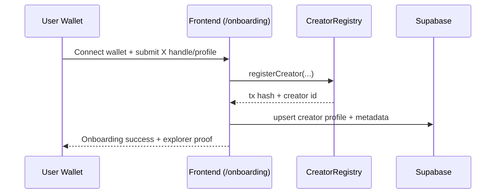
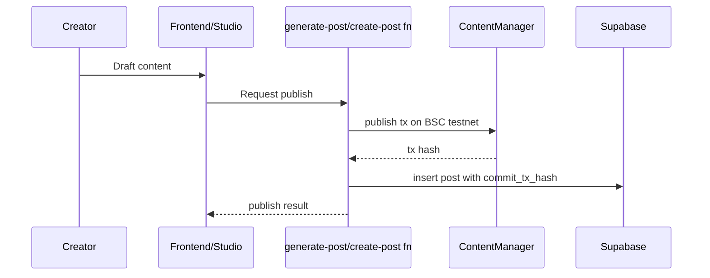
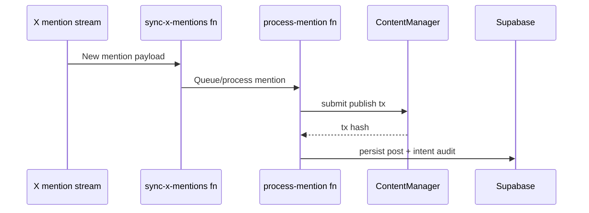
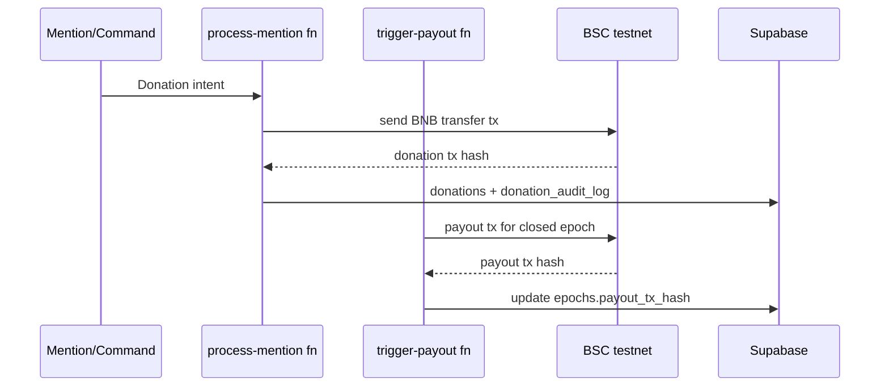
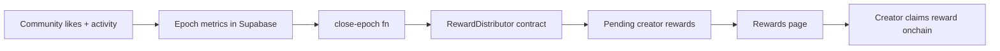

# RailMint

RailMint is a proof-carrying creator platform on BNB Chain testnet. Creators onboard with a wallet, publish AI-assisted content, receive community engagement, and earn epoch rewards. Critical actions produce real onchain transactions, then persist metadata in Supabase.

## What RailMint does

- Wallet-based creator onboarding linked to X identity.
- Onchain-backed post publishing and mention-triggered publishing.
- Community feed, likes, leaderboard, and rewards views.
- Epoch payout and donation transaction tracking with explorer proofs.
- Hybrid architecture: React frontend + Solidity contracts + Supabase edge functions.

## How RailMint works

### Core components

- `CreatorRegistry.sol`: creator registration and creator profile state.
- `ContentManager.sol`: content publishing and like/unlike logic.
- `RewardDistributor.sol`: epoch creation, reward distribution, reward claiming.
- Frontend (`src/`): wallet UX, route pages, transaction flow, explorer linking.
- Supabase Edge Functions (`supabase/functions/*`): AI generation, X mention ingestion/processing, payouts, and automation.

### High-level flow

1. User connects wallet and completes onboarding.
2. Creator is registered onchain, mirrored in Supabase profile tables.
3. Content publish requests create proof-bearing transaction(s), then persist post records.
4. Community engagement updates feed and rankings.
5. Epoch close + payout paths execute onchain and persist tx hashes.

### Flow diagrams

#### 1) Creator onboarding



#### 2) Content publishing



#### 3) Mention-triggered publish



#### 4) Donation + payout transactions



#### 5) Rewards + leaderboard lifecycle



### Routes

- `/` home
- `/onboarding`
- `/feed`
- `/post/:id`
- `/leaderboard`
- `/rewards`
- `/studio/*`
- `/studio/oauth-callback`

## Prerequisites

- Node.js 18+ (recommended 20+)
- npm
- Git
- Wallet (MetaMask or equivalent)
- BNB testnet funds for deploy/signer wallets
- Optional for E2E: Bun (current Playwright webServer command uses `bun run dev` in `playwright.config.ts`)

## Install the repo

```bash
git clone https://github.com/Rail-Mint/railmint
cd railmint
npm install
```

## Environment setup

Use the project template:

```bash
cp .env.example .env.local
```

Fill required values in `.env.local`.

### Minimum for frontend app boot

- `VITE_SUPABASE_URL`
- `VITE_SUPABASE_PUBLISHABLE_KEY`
- `VITE_BLOCKCHAIN_EXPLORER_BASE_URL`
- `VITE_WALLETCONNECT_PROJECT_ID`

### Studio testing bypass (optional)

- `VITE_TEST_BYPASS_WALLET_LOGIN=true` to bypass Studio wallet gate for UI automation.
- Intended for local testing only; keep `false` in normal/dev/prod usage.

### Minimum for contract deploy

- `BSC_TESTNET_RPC_URL`
- `TESTNET_PRIVATE_KEY`

### Minimum for contract verification

- `BSC_SCAN_API_KEY` (needed for `hardhat verify`)

### Minimum for proof-carrying edge flows

- `SUPABASE_URL`
- `SUPABASE_SERVICE_ROLE_KEY`
- `BNB_TESTNET_RPC_URL`
- `BNB_TESTNET_EXPLORER_URL`
- `BNB_TESTNET_PRIVATE_KEY`
- `OPENROUTER_API_KEY`
- `OPENROUTER_API_URL`
- `OPENROUTER_EMBEDDINGS_API_URL`
- `POST_URL_BASE`

Additional integrations (X, Upload-Post, payouts, tuning knobs) are documented in `.env.example`.

## Local development

```bash
npm run dev
```

Default app URL: `http://localhost:8080`

## Smart contracts

Compile:

```bash
npm run hardhat:compile
```

Deploy to BSC testnet:

```bash
npm run hardhat:deploy:bsc
```

After deployment, copy contract addresses into `.env.local`:

- `VITE_CREATOR_REGISTRY_ADDRESS`
- `VITE_CONTENT_PUBLISHING_ADDRESS` (ContentManager address)
- `VITE_REWARD_DISTRIBUTOR_ADDRESS`

Verify (requires `BSC_SCAN_API_KEY`):

```bash
npx hardhat verify --network bscTestnet <address> [constructor_args...]
```

## Reproducible E2E proof flow

This sequence is intended for reproducibility and tx-hash verification.

1. Prepare env values in `.env.local` (frontend + edge + chain keys).
2. Compile and deploy contracts to BSC testnet.
3. Update frontend contract address envs from deployment output.
4. Start app:

```bash
npm run dev
```

5. Execute proof-producing actions:
   - Onboard creator with wallet.
   - Publish content from app/studio flow.
   - Trigger mention-driven publish (if X pipeline configured).
   - Trigger donation/payout paths if configured.
6. Verify tx hashes in explorer links from UI or DB fields:
   - `posts.commit_tx_hash`
   - `donations.tx_hash`
   - `epochs.payout_tx_hash`

## E2E/UI testing notes

- Unit tests:

```bash
npm run test
```

- Playwright config requires `PLAYWRIGHT_BASE_URL`.
- Current Playwright web server command is `bun run dev`; install Bun or adjust `playwright.config.ts` to `npm run dev`.

### Real wallet E2E lane (Synpress + Playwright)

Use this lane to test true MetaMask extension login/sign flows (not bypass mode).

```bash
npm install
npx playwright install chromium

# optional: copy wallet env template
cp .env.wallet.example .env.wallet

# build deterministic wallet cache
npm run e2e:wallet:cache

# run wallet lane (local chain)
npm run e2e:wallet:local

# run wallet lane (testnet)
npm run e2e:wallet:testnet
```

Key files:

- `playwright.wallet.config.ts`
- `test/wallet-setup/basic.setup.ts`
- `tests/wallet/studio-wallet-login.spec.ts`
- `tests/wallet/README.md`

## Useful scripts

- `npm run dev`
- `npm run build`
- `npm run preview`
- `npm run lint`
- `npm run test`
- `npm run test:watch`
- `npm run e2e:ui`
- `npm run e2e:wallet:cache`
- `npm run e2e:wallet`
- `npm run e2e:wallet:local`
- `npm run e2e:wallet:testnet`
- `npm run e2e:wallet:headless`
- `npm run hardhat:compile`
- `npm run hardhat:test`
- `npm run hardhat:deploy:bsc`

## Project structure

```text
contracts/                 Solidity contracts
scripts/                   Deployment scripts
src/                       React app
supabase/functions/        Edge functions and automations
hardhat.config.cjs         Hardhat networks + verify config
playwright.config.ts       E2E config
.env.example               Canonical environment template
```

## Troubleshooting

- WalletConnect 400/403 errors: set a valid `VITE_WALLETCONNECT_PROJECT_ID`.
- Deploy network missing: set `BSC_TESTNET_RPC_URL` and `TESTNET_PRIVATE_KEY`.
- Verify failing: set `BSC_SCAN_API_KEY`.
- Feed empty: ensure Supabase URL/key and data pipeline are configured.

## License

MIT
