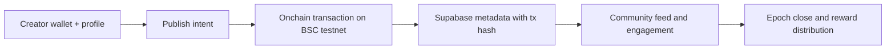

# Project: Problem, Solution and Impact

## 1. Problem

- Creator monetization and credibility are fragmented across social platforms and closed backend systems.
- Communities cannot easily verify whether creator actions (publish, donation, payout) are real or simulated.
- Onchain creator products often focus only on token mechanics and do not map social intent to verifiable execution.

## 2. Solution

RailMint is a proof-carrying creator platform on BNB Chain testnet.

- Creators onboard with wallet identity and optional X linkage.
- Content publishing and payout-critical flows generate real onchain transactions.
- Supabase stores indexed metadata, while tx hashes remain auditable through block explorer links.
- Community actions (likes/activity) feed epoch-based ranking and rewards lifecycle.

## 3. Business and Ecosystem Impact

- For creators: transparent proof of activity and traceable reward flows.
- For communities: verifiable contribution-to-reward mapping.
- For BNB ecosystem: practical demo of social + AI + onchain accountability patterns.

## 4. Limitations and Future Work

- Current deployment targets testnet; production hardening and gas/risk optimization remain.
- Wallet UX and signer management can be simplified for broader adoption.
- Planned work: more robust anti-spam scoring, richer proof dashboards, and stronger privacy controls around sensitive profile data.
