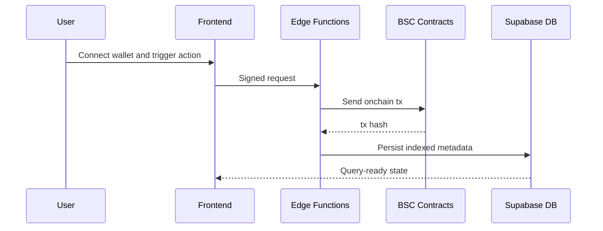

# Technical: Architecture, Setup and Demo

## 1. Architecture

### System overview

RailMint combines a React frontend, Supabase edge functions, and Solidity contracts on BNB Chain testnet.

### Components

- Frontend (`src/`): wallet UX, onboarding, feed, leaderboard, rewards, studio.
- Edge functions (`supabase/functions/`): content generation, mention processing, payout and automation.
- Smart contracts (`contracts/`): `CreatorRegistry`, `ContentManager`, `RewardDistributor`.
- Database (`supabase/`): creators, posts, likes, epochs, rewards, mentions, audit logs.

### Data flow



### Onchain vs offchain

- Onchain: creator registration, publish commits, reward payout/claim paths.
- Offchain: AI generation, social ingestion, ranking/indexing, dashboard queries.

### Security notes

- Wallet-signed actions for sensitive mutations.
- Service-role-only writes for critical edge flows.
- RLS-enabled tables and tightened policy scope for sensitive data.

## 2. Setup and Run

### Prerequisites

- Node.js 18+
- npm
- Wallet extension (MetaMask)
- BNB testnet RPC access and funded signer key(s)

### Environment

1. Copy env template:

```bash
cp .env.example .env.local
```

2. Fill required keys (minimum):

- Frontend: `VITE_SUPABASE_URL`, `VITE_SUPABASE_PUBLISHABLE_KEY`, `VITE_WALLETCONNECT_PROJECT_ID`
- Backend/edge: `SUPABASE_URL`, `SUPABASE_SERVICE_ROLE_KEY`
- Chain: `BNB_TESTNET_RPC_URL`, `BNB_TESTNET_PRIVATE_KEY`

### Install and build

```bash
npm install
npm run build
```

### Run locally

```bash
npm run dev
```

App URL: `http://localhost:8080`

### Contracts

```bash
npm run hardhat:compile
npm run hardhat:deploy:bsc
```

## 3. Demo Guide

### Access

- Open app home page.
- Connect wallet.

### User flow

1. Onboard creator profile.
2. Publish content (studio or mention-triggered flow).
3. Observe feed/leaderboard updates.
4. Close epoch and execute payout path.
5. Verify tx hashes in explorer links.

### Expected outcomes

- Critical actions surface real tx hashes.
- Rewards and leaderboard reflect engagement + epoch lifecycle.

### Troubleshooting

- Wallet not connecting: verify network and WalletConnect project id.
- Edge function failures: verify Supabase URL/service role keys.
- Missing tx links: verify explorer base URL and contract addresses.
